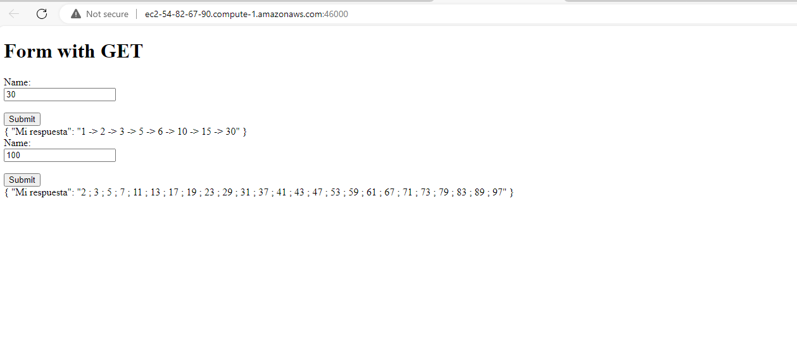
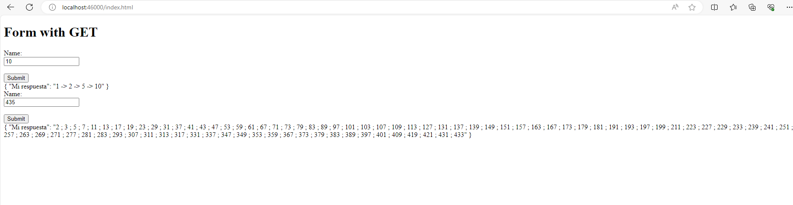

# parcialAREP
Parcial 2 AREP

COMO CLONAR EL PROYECTO?

```
git clone https://github.com/jacro103/Arep_ParcialCorte.git 
```
 

Antes de todo nunca estaria mal: Ejecutar "mvn clean install" en la ubicacion de tu archivo 
```
mvn clean install
```

Ejecutas el anterior comando en la carpera que te quede mas comodo, hay maneras de correrlo:

1. AWS pero lastimosaente deberiamos dejar el servidor prendido para ver su funcionamiento (), se  deja un video de Youtube para su visualizacion;
```
http://ec2-54-82-67-90.compute-1.amazonaws.com:46000/
```
   

2. Usa tu IDLE preferido puede ser NETBEANS y lo ejecutas RUN de manera interactiva 
```
http://localhost:46000/index.html
```

3. En CMD puedes correr el siguiente comando en windows
```
java -cp "target/classes;target/dependency/*" com.mycompany.arepparcial.ArepParcial
```

y en linux
```
java -cp "target/classes:target/dependency/*" com.mycompany.arepparcial.ArepParcial
```

Encontrara una carpeta de imagenes donde estan  laspruebas del lanzamiento en ec2 y localhost

<br>
<br>

##Autor
Jose Alejandro Correa Rodriguez

## Construido con

* [Maven](https://maven.apache.org/) - Gestión de dependencias
* [Java](https://www.java.com/es/) - Lenguaje Utilizado
* [GitHub](https://git-scm.com/) - Control de Versiones
* [AWS](https://awsacademy.instructure.com/courses/58453/modules/items/5197637) - Despliegue


## Video
[VIDEO  AWS que se hizo en la hora del parcial](https://pruebacorreoescuelaingeduco-my.sharepoint.com/:v:/g/personal/jose_correa-r_mail_escuelaing_edu_co/ERR8FkBA3WRIkYRi5p6FjuQBL5wE3m_ovp5jpgA83qdy_Q?e=fcDWvA&nav=eyJyZWZlcnJhbEluZm8iOnsicmVmZXJyYWxBcHAiOiJTdHJlYW1XZWJBcHAiLCJyZWZlcnJhbFZpZXciOiJTaGFyZURpYWxvZy1MaW5rIiwicmVmZXJyYWxBcHBQbGF0Zm9ybSI6IldlYiIsInJlZmVycmFsTW9kZSI6InZpZXcifX0%3D)

[video en casa antes de media noche](https://pruebacorreoescuelaingeduco-my.sharepoint.com/:v:/g/personal/jose_correa-r_mail_escuelaing_edu_co/ER7T-siUClRClZXnlSsvkZMBRsKRBKAXQDnp3gnT4X6fNg?e=3K0qHy&nav=eyJyZWZlcnJhbEluZm8iOnsicmVmZXJyYWxBcHAiOiJTdHJlYW1XZWJBcHAiLCJyZWZlcnJhbFZpZXciOiJTaGFyZURpYWxvZy1MaW5rIiwicmVmZXJyYWxBcHBQbGF0Zm9ybSI6IldlYiIsInJlZmVycmFsTW9kZSI6InZpZXcifX0%3D)


   

